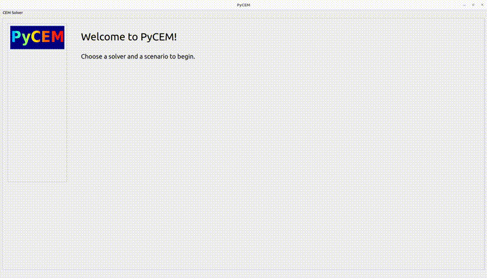

# PyCEM-Qt

## Overview

PyCEM-Qt is a computational electromagnetics (CEM) learning project that
visualizes electromagnetic simulations using PyVista and the PySide6 wrapper for Qt.  This project is essentially a fork of my [PyCEM repository](https://github.com/AlexMGitHub/PyCEM) that uses a Qt GUI instead of a Dash webapp.

The purpose of this learning project is threefold:

1. Learn more about the three major CEM techniques: FDTD, MoM, and FEM.
2. Learn how to use PyVista and PySide6 to build and visualize meshes for these
   CEM techniques.
3. Improve my proficiency in writing C code, and integrate my C shared
   libraries with Python code to enable fast parallel multithreading in a
   Python web application.

PyCEM-Qt is currently a work in progress.  The FDTD simulations are written in C, and the shared libraries must be built using the following commands within the `src/C/makefiles/` directory:

`make -f MakeBenchmark.mk`
`make -f MakeFDTD_TMz.mk`

The application can then be run by executing the following command while within the `src/pycem-qt/` directory:

`python -m app`

Note that if you would like to modify the GUI in QtDesigner using the command in Appendix A that you must update the *image_rc* import line at the top of the file to include the modules directory:

`import modules.images_rc`

The sections below describe the development and features of PyCEM-Qt.

## Approach to Creating PyCEM-Qt

PyCEM-Qt is functionally identical to the PyCEM project, but with a different programming approach.  PyCEM used the Dash framework combined with Docker to create a cross-platform web-based GUI.  PyCEM-Qt uses the Qt framework to create a cross-platform application.

### PySide6 and Qt Designer

[PySide6](https://wiki.qt.io/Qt_for_Python) is a Python wrapper for the [Qt 6.0+ framework](https://www.qt.io/product/qt6) for creating cross-platform GUIs.  I found that the Dash webapp framework that I used in the PyCEM repository had a few limitations with regards to its callback system that caused a lot of headaches for me.  PySide6 has a much more robust callback system, and has support for multithreading, progress bars, and long-running threads.  These issues in particular were a struggle when using the Dash framework.

To build the GUI, I use a mix of Python code and a tool called [Qt Designer](https://doc.qt.io/qt-6/qtdesigner-manual.html).  Qt Designer allows the user to quickly drag-and-drop widgets onto a form and construct their Qt GUI by hand.  The resulting `.ui` file can be converted to Python code and imported into a larger Python program.

## Motivation for writing a C Library

Python has two major performance limitations: one, it is an interpreted language and as such will always be slower than a compiled language.  Two, Python has the so-called "Global Interpreter Lock" (GIL) which prevents truly parallel multithreading.  Python's `threading` module is limited to concurrent multithreading, meaning that only one thread can execute Python code at once because each thread must acquire the GIL before executing code.  Parallel
computation can be achieved by using the `multiprocessing` library, but subprocesses have more overhead than threads and do not benefit from shared
memory.

Both of these performance limitations can be bypassed by writing C code.  C is a compiled language, and is well-known to be highly optimized and fast to
execute.  In addition, by using an external C library the GIL can be bypassed to allow for true parallel multithreading.  The CEM solver will be running many
CPU-intensive routines and can benefit from parallelism.  Writing C code to execute these routines will significantly improve the performance of the
solver.

Functions written in C and compiled as a shared library can be called in Python code as if they were written natively in Python.  One method of doing so is to use the `ctypes` foreign function library.

### PyVista

[PyVista](https://www.pyvista.org/) is a Python wrapper of the Visualization Toolkit (VTK).  It makes 3D visualization and mesh analysis for scientific and
engineering applications possible in Python.  This is exactly the type of visualization tool that grid or mesh-based CEM solvers require!  And, it allows
the export of animations as GIF or MP4 files.

## Current Features

To date, I have created a functional app that allows the user to browse a collection of scenarios that can be simulated using different CEM codes.  The user can run the simulations with a click of a button, and then view the results in the GUI.  The results may be tabular data, images, or animations.  The different CEM codes available in PyCEM-Qt are discussed next.

### FDA

I used Finite Difference Analysis (FDA) to perform quasistatic simulations of 2D transmission line cross-sections.  This simulation allows me to extract the single-ended and differential impedance of many common transmission lines.  I also compare the results of the FDA simulation with analytical formulas for
impedance.

Calculating the characteristic impedance of a transmission line cross-section is a very common task, and yet it is hardly discussed at all in the CEM literature.  In addition, I found that many of the analytical formulas for these transmission lines contained typographical errors in both online calculators and in references such as
IPC-2141A.

After fruitlessly searching through several CEM textbooks, I eventually referred to lectures presented by Raymond C. Rumpf from
[EMPossible](https://empossible.net/) to write the FDA solver.

Currently, the solver only accepts lossless materials and does not include the effects of frequency.  The code is entirely written in Python, although I do utilize `numba` to speed-up the calculations.

The presented results are tabular data containing the simulated impedance of the transmission line compared to the analytical solution.  There are also field plots of the transmission line structures generated using PyVista.

### FDTD

Finite Difference Time Domain (FDTD) is considered the easiest CEM code to get started with.  I heavily relied on Professor John B. Schneider's e-book [Understanding the FDTD Method](https://eecs.wsu.edu/~schneidj/ufdtd/).  I used his [source code](https://github.com/john-b-schneider/uFDTD) as a starting
point for my FDTD solver, which is permitted per the Creative Commons Attribution-ShareAlike 4.0 International license.

The simulation scenarios are defined as Python classes, and NumPy arrays are passed to the C code as a `struct` of pointers.  Once the simulation is complete, the NumPy array containing the E-field values at each time step is represented as a PyVista mesh and used to generate an animation of the E-fields changing over time.

Only 2D scenarios are currently considered, although eventually the code could be generalized to include 3D scenarios.  Because FDTD is a time domain solver, the results include animated field plots that can be viewed once the simulation is complete.  The field plot animations generated using PyVista are saved to disk as `.MP4` files.

In addition to writing a three-dimensional FDTD solver next, future work also includes exploring the
possibility of creating ports that I can extract S-parameters and characteristic impedances from.  It would also be of interest to calculate far field radiation patterns for antenna simulations.  The long-term goal is to create similar solvers for both Method of Moments (MoM) and Finite Element Method (FEM) codes.

### MoM

WIP.

### FEM

WIP.

## References

* C
  * <http://gcc.gnu.org/onlinedocs/gcc/Warning-Options.html>
  * <http://websites.umich.edu/~eecs381/handouts/CHeaderFileGuidelines.pdf>
  * <https://people.engr.tamu.edu/j-welch/teaching/cstyle.html>
  * <https://stackoverflow.com/questions/63220508/how-can-i-define-a-pointer-to-variable-length-array-vla-in-a-struct-or-equiva>
  * <https://stackoverflow.com/questions/14808908/pointer-to-2d-arrays-in-c>
  * <https://stackoverflow.com/questions/36890624/malloc-a-2d-array-in-c>

* Python
  * <https://numpy.org/doc/stable/reference/arrays.scalars.html#numpy.int_>
  * <https://stackoverflow.com/questions/57025836/how-to-check-if-a-given-number-is-a-power-of-two>

* C Extension
  * <https://stackoverflow.com/questions/43148188/python-2d-array-i-c-using-ctypes>
  * <https://docs.python.org/3/library/ctypes.html>
  * <https://www.cprogramming.com/tutorial/shared-libraries-linux-gcc.html>
  * <https://medium.com/meatandmachines/shared-dynamic-libraries-in-the-c-programming-language-8c2c03311756>
  * <https://github.com/realpython/materials>
  * <https://realpython.com/python-bindings-overview/#ctypes>
  * <https://realpython.com/build-python-c-extension-module/#extending-your-python-program>
  * <https://dbader.org/blog/python-ctypes-tutorial>

* Matrices
  * <https://cse.buffalo.edu/faculty/miller/Courses/CSE633/Ortega-Fall-2012-CSE633.pdf>
  * <https://cse.buffalo.edu/faculty/miller/Courses/CSE702/Prithvisagar-Rao-Fall-2020.pdf>

* FDTD
  * <https://eecs.wsu.edu/~schneidj/ufdtd/>
  * <https://github.com/john-b-schneider/uFDTD>

* FDA
  * <https://empossible.net/academics/emp4301_5302/>
  * <https://empossible.net/academics/emp4301_5301/>
  * <https://empossible.net/wp-content/uploads/2020/09/Lecture-Formulation-of-TL-Analysis.pdf>
  * <https://empossible.net/wp-content/uploads/2020/06/Lecture-Numerical-Analysis-of-Transmission-Lines.pdf>
  * <https://empossible.net/wp-content/uploads/2020/06/Lecture-Using-TLCALC.pdf>
  * <https://empossible.net/wp-content/uploads/2018/03/Topic-4-Numerical-Analysis-of-Transmission-Lines.pdf>
  * <https://www.youtube.com/watch?v=FS5h_L-3WlI&list=PLLYQF5WvJdJVsGsjkVBz6Odf9aJxbd2Hv>
  * <https://www.youtube.com/watch?v=KWH4UHaB0_4&list=PLLYQF5WvJdJVQsPyJsIb2-XND9u-BYweQ&index=63>
  * <https://www.youtube.com/watch?v=YtPFj3OvMy8&list=PLLYQF5WvJdJVQsPyJsIb2-XND9u-BYweQ&index=63>
  * <https://www.youtube.com/watch?v=3k9NYhP_Yyo&list=PLLYQF5WvJdJVQsPyJsIb2-XND9u-BYweQ&index=62>

## Appendix A: Useful Commands

* Compile Qt Designer GUI into Python code

`pyside6-uic PyCEM_GUI.ui -o PyCEM_GUI.py`

* Compile Qresources (images) into Python code

`pyside6-rcc images.qrc -o images_rc.py`

* Start Qt Designer

`pyside6-designer`
